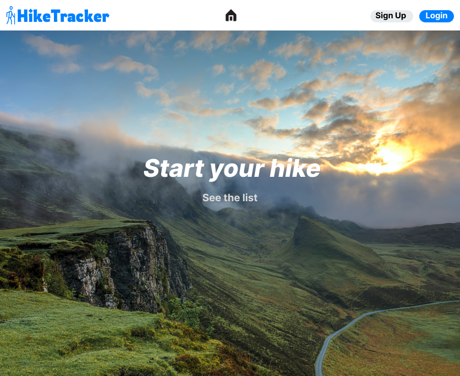

# HikeTracker

Project developed by ***Team-12*** for the course "Software Engineering II," attended during the academic year 2022/23 at Politecnico di Torino, Master's Degree in Computer Engineering.

## Table of Contents

1. [React Client Application Routes](#react-client-application-routes)
2. [API Server](#api-server)
3. [Database Tables](#database-tables)
4. [Test](#test)
5. [Technologies](#technologies)
   - [Frontend](#frontend)
   - [Backend](#backend)
   - [Test](#test)
6. [Source Directory Structure](#source-directory-structure)
7. [Mocks](#mocks)
8. [Team members](#team-members)

## React Client Application Routes

All routes available are listed below

- **`/`** : Home Page 
- **`/login`** : Login Page
- **`/signup`** : Registration Form
- **`/hikes`** : Visitor Page
- **`/hikes/:${id}`** : Page with details and Map
- **`/*`** : 404 Not found 


## API Server

Hereafter, we report the designed HTTP APIs, also implemented in the project.

- POST `/api/sessions`

  - Description: Login of a user by providing email and password.
  - Request body: An object representing the user informations.

  ```
  {
      "email":"stefanopioli@acmilan.com",
      "password":"password"
  }
  ```

  - Response: `200 OK` (success) or `503 Service Unavailable` (generic error). If the login informations are not correct, or if the user did not verify his email `401 Unauthorized`.
  - Response body: User informations in case of success. Error message in case of failure.

  ```
  {
      "id": 2,
      "email": "stefanopioli@acmilan.com",
      "username": "stefanopioli",
      "name": "stefano",
      "surname": "pioli",
      "role": "hiker",
      "phoneNumber": "+393456589563",
      "gender":"M"
  }
  ```

- DELETE `/api/sessions/current`

  - Description: Logout of a logged in user.
  - Request body: _None_
  - Response: `200 OK` (success).If the user is not logged in, `401 Unauthorized`.
  - Response body: _None_

- GET `/api/sessions/current`
  - Description: Retrieve the logged user informations"
  - Request body: _None_
  - Response: `200 OK` (success) or `503 Service Unavailable` (generic error). If the user is not logged in, `401 Unauthorized`.
  - Response body: User informations in case of success. Error message in case of failure.
  ```
  {
      "id": 2,
      "email": "stefanopioli@acmilan.com",
      "username": "stefanopioli",
      "name": "stefano",
      "surname": "pioli",
      "role": "hiker",
      "phoneNumber": "+393456589563",
      "gender":"M"
  }
  ```

- POST `/api/signup`
  - Description: Sign Up a new user by providing his data.
  - Request body: An object representing the user informations (name,surname,phoneNumber are mandatory only if role is localguide,hutworker,emergencyoperator)

  ```
  {
      "email":"stefanopioli@acmilan.com",
      "username":"stefanopioli",
      "password":"password",
      "name":"stefano",
      "surname":"pioli",
      "phoneNumber":"+393323232232",
      "role":"localGuide",
      "gender":"M"
  }
  ```

  - Response: `201 Created` (success) or `503 Service Unavailable` (generic error). If the signup informations are not correct `422 Unprocessable entity`, if the username/email are already present `409 Conflict`.
  - Response body: Confirmation message.

  ```
  {
      "message": "User signed up in the system. Please check your mail to activate the account"
  }
  ```

- GET `/api/signup/:confirmationCode`
  - Description: Confirm a user by his confirmation code.
  - Request body: _None_
  - Response: HTML confirmation page, or `503 Service Unavailable` (generic error). If the user is already signed up or if the verification code is not valid HTML error page
  - Response body: _None_

- GET `/api/hikes`
  - Description: Retrieve list of available hikes generic information
  - Request body: _None_
  - Response: `200 OK` (success) or `503 Service Unavailable` (generic error). 
  - Response body: Hike information in case of success. Error message in case of failure.
  ```
  [
     {
          "id": 1,
          "title": "Trail to MONTE FERRA",
          "description": "Leaving ...",
          "length": 13,
          "expectedTime": 5,
          "ascent": 1280,
          "difficulty": "Professional Hiker",
          "authorName": "aldo",
          "authorSurname": "baglio",
          "uploadDate": "2022-01-10",
          "photoFile": "https://images.unsplash.com/photo-1519681393784-d120267933ba?ixlib=rb-4.0.3&ixid=MnwxMjA3fDB8MHxwaG90by1wYWdlfHx8fGVufDB8fHx8&auto=format&fit=crop&w=1170&q=80",
          "latitude": 44.5744896554157,
          "longitude": 6.98160500000067,
          "altitude": 1812,
          "city": "Bellino",
          "province": "Cuneo ",
          "region": "Piemonte"
      },     
      {
          "id": 2,
          "title": "Trail to ROCCA PATANUA",
          "description": "Patanua ..",
          "length": 9,
          "expectedTime": 5.5,
          "ascent": 980,
          "difficulty": "Professional Hiker",
          "authorName": "stefano",
          "authorSurname": "pioli",
          "uploadDate": "2022-04-12",
          "photoFile": "https://images.unsplash.com/photo-1454496522488-7a8e488e8606?ixlib=rb-4.0.3&ixid=MnwxMjA3fDB8MHxwaG90by1wYWdlfHx8fGVufDB8fHx8&auto=format&fit=crop&w=1176&q=80",
          "latitude": 45.15013536737316,
          "longitude": 7.236844649658008,
          "altitude": 1430,
          "city": "Condove",
          "province": "Torino ",
          "region": "Piemonte"
     },
    ....
  ]
  ```

- GET `/hikedetails/:hikeId`
  - Description: Retrieve details (including point information) for a specific hike
  - Request body: hikeId
  - Response: `200 OK` (success), `404 NOT FOUND` if the id does not correspond to a hike, `503 Service Unavailable` (generic error). 
  - Response body: detailed information of the hike including a list of points. Error message in case of failure.
  ```
  {
     "id": 1,
     "title": "Trail to MONT FERRA",
     "description": "Leaving the car ...",
     "authorName": "aldo",
     "authorSurname": "baglio",
     "uploadDate": "2022-01-10",
     "photoFile": "www. ..."
     "length": 13,
     "expectedTime": 5,
     "ascent": 1280,
     "difficulty": 4,
     "startPointId": 1,
     "endPointId": 2,
     "gpx": "gpx file data if loggedin, nothing ("") if not logged in"
     "pointList": 
        [
          {
               "id": 1,
               "name": "Refugio Melezè ...",
               "description": "The building was a ...",
               "type": "hut",
               "latitude": 44.5744896554157,
               "longitude": 6.98160500000067,
               "altitude": 1812,
               "city": "Berllino",
               "province": "Cuneo"
          },
          {
               "id": 2,
               "name": "Monte Ferra",
               "description": "Peak of ...",
               "type": "gpsCoordinates",
               "latitude": 44.57426,
               "longitude": 6.98264,
               "altitude": 3094,
               "city": null,
               "province": null
          } 
        ]
  }     

- POST `/api/hikes`
  - Description: Insert an Hike in the system.
  - Request body: An object representing the hike
  ```
  {
     "title":"sss",
	"description":"kkk",
	"expectedTime":33.33,
	"difficulty":"Hiker",
	"photoFile":"http:// ... "
  }   
  ```
  - Request file: The GPX file
  - Response: `201 CREATED` (success), `420` if the input is not correct, `503 Service Unavailable` (generic error). 
  - Response body: Confirmation message.
  ```
  {
      "message": "Hike inserted in the system"
  }
  ```


- GET `/api/hikegpx/:hikeId`
  - Description: Download the gpx file of the relative :hikeId.
  - Request body: _None_
  - Response: The gpx file, or `503 Service Unavailable` (generic error). `404 NOT FOUND` If the gpx file is not present
  - Response body: _None_

- POST `/api/parking`
  - Description: Insert parking point in the system.
  - Request body: An object representing the parking point
  ```
  {
     "title":"parking",
	"description":"big parking area near the start of the hike!",
	"latitude": 44.57426,
     "longitude": 6.98264,
     "altitude": 3094,
     "city": "Condove",
     "province": "Torino ",
     "region": "Piemonte"
  }   
  ```
  - Response: `201 CREATED` (success), `422` if the input is not correct, `503 Service Unavailable` (generic error). 
  - Response body: Confirmation message.
  ```
  {
      "message": "Parking inserted in the system"
  }
  ```

- POST `/api/hut`
  - Description: Insert hut in the system.
  - Request body: An object representing the hut information
  ```
  {
     "title":"hut ...",
	"description":"breakfast included ...",
	"latitude": 44.57426,
     "longitude": 6.98264,
     "altitude": 3094,
     "city": "Condove",
     "province": "Torino ",
     "region": "Piemonte"
     "roomsNumber": 2,
	"bedsNumber": 3,
     "phoneNumber": "+393323232232",
     "photoFile": "http:// ... "
  }   
  ```
  - Response: `201 CREATED` (success), `422` if the input is not correct, `503 Service Unavailable` (generic error). 
  - Response body: Confirmation message.
  ```
  {
      "message": "Hut inserted in the system"
  }
  ```

## Database Tables

#### _Hike_ includes all hikes specifications
 ```
     Hike(id,title,description,length,expectedTime,ascent,difficulty,startPointId,endPointId,authorId,uploadDate,gpxFile,photoFile)
     PRIMARY KEY ( Id )
     FOREIGN KEY (authorId, startPointId, endPointId) REFERENCES User ( id ) , Point ( id ) , Point ( id )
 ```

#### _HikePoint_ includes relation between Hike and Point
```
     HikePoint( hikeId,pointId)
     PRIMARY KEY ( hikeId , pointId )
     FOREIGN KEY (hikeId , pointId ) REFERENCES Point ( id ) , Point ( id )
```

#### _Point_ includes all Points specifications
```
     Point( id, name, description, type, longitude, latitude, altitude, city, province )
     PRIMARY KEY ( id )
```

#### _Hut_ includes all Huts specification
```
     Hut( id, roomsNumber, bedsNumber, whenIsOpen,phoneNumber, photosPath, pointId )
     PRIMARY KEY ( id )
     FOREIGN KEY ( pointId ) REFERENCES Point ( id )
```

#### _User_ includes all Users specification
```
     User( id, email, username, role, name, surname, phoneNumber, hash, salt, verifiedEmail, confirmationCode )
     PRIMARY KEY ( id )
```

#### _UserPreferences_ includes preferences specified by the user
```
     UserPreferences( id, duration, altitude, ascent, length, difficulty, userId )
     PRIMARY KEY ( id )
      FOREIGN KEY ( userId ) REFERENCES User ( id )

```

## Users Credentials
```
 aldobaglio@gmail.com : password
 Email verified
```
```
 stefanopioli@acmilan.com : password
 Email verified
```
```
 antonioconte@gmail.com : password
 Email NOT verified
```
```
 adrianahevia@gmail.com : Password#20
 Email verified
```

### The tables used in this project are

## Test

## Technologies

### Frontend

```names
- Axios
- Bootstrap
- Formik
- React
- React Bootstrap
- React Icons
- React Router Dom
- React Toastify
- Yup
- Dayjs
````

### Backend

```names
- Cors
- Express
- Express Session
- Express Validator
- Morgan
- Passport
- Passport Local
- Sqlite3
- Dayjs
- Nodejs
````

### Test

```names
- Jest
- Mocha
- Cypress
````

## Source Directory Structure

Here you can find a visual schema of source directory structure by means the tree chart below and a short description for each folder.

```structure
|--- /client
     |--- /public
          |--- /favicon.ico
          |--- /index.html
          |--- /logo192.png
          |--- /logo512.png
          |--- /manifest.json
          |--- /robots.txt
     |--- /src
          |--- /assets
               |--- /carousel
                    |--- /first.jpg
                    |--- /second.jpg
                    |--- /third.jpg
                    |--- /fourth.jpg
               |--- /logo
                    |--- /logo-black.svg
                    |--- /logo-color.svg
                    |--- /logo-no-background.svg
                    |--- /logo-white.svg
          |--- /components
               |--- /ui-core
                    |--- /index.js
               |--- /utils
                    |--- /index.js
               |--- /index.js
          |--- /hooks
               |--- /useNotification.js
          |--- /services
               |--- /api.js
          |--- /views
          |--- /App.css
          |--- /App.jsx
          |--- /App.test.jsx
          |--- /index.css
          |--- /index.js
          |--- /logo.svg
          |--- /reportWebVitals.js
          |--- /setupTests.js
     |--- /.gitignore
     |--- /package-lock.json
     |--- /package.json
     |--- /README.md
|--- /mocks
     |--- /homePage
          |--- /Homepage_1.png
          |--- /Homepage_2.png
          |--- /Homepage_3.png
          |--- /Homepage_4.png
|--- /retrospective
|--- /server
     |--- /config
          |--- /auth.config.js
          |--- /nodemailer.config.js
     |--- /dao
          |--- /hikeDao.js
          |--- /userDao.js
     |--- /mockDB
          |--- /unitTests
                    |--- /hike.test.js
          |--- /mockDB.js
          |--- /mockHikeTracker.db
     |--- /models
          |--- /hikeModel.js
          |--- /pointModel.js
     |--- /routes
          |--- /hikeRoute.js
          |--- /sessionRoute.js
          |--- /signUpRoute.js
     |--- /utils
          |--- /afterConfirmEmailPages
               |--- /confirm.html
               |--- /error.html
          |--- /gpxFiles
               |--- /1_Monte_Ferra.gpx
               |--- /2_Rocca_Patanua.gpx
          |--- /sessionUtil.js
          |--- /signUpUtil.js
          |--- /validationUtil.js
     |--- /.gitignore
     |--- /index.js
     |--- /hikeTracker.sqlite3     
     |--- /package-lock.json
     |--- /package.json
     |--- /README_server.md
|--- /README.MD
```

## Mocks

### HomePage Carousel



## Team members

| Matricola   |   Surname   | Name        |
| :---------: | :---------  | :---------- |
| s301146     | Colelli     | Antonio     |
| s294427     | Hevia       | Adriana     |
| s305925     | Miccono     | Edoardo     |
| s303399     | Sambin      | Gabriele    |
| s303907     | Tamburo     | Luca        |
| s301587     | Trovero     | Fabio       |
