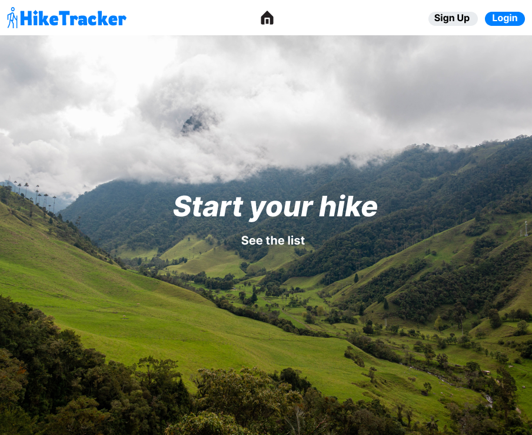
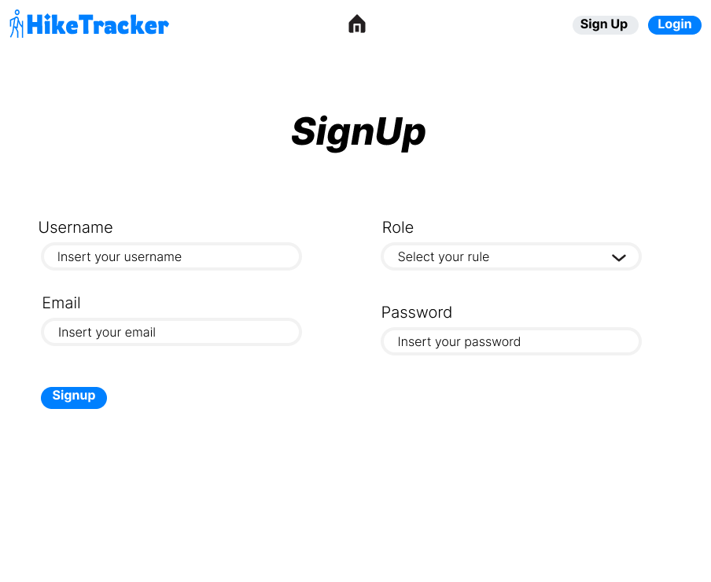
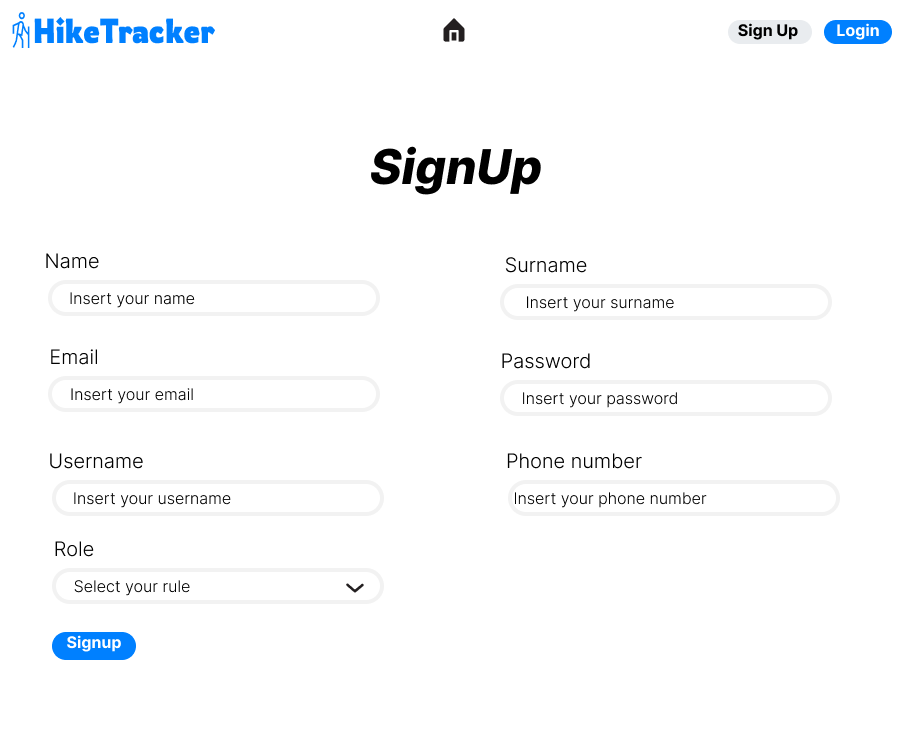
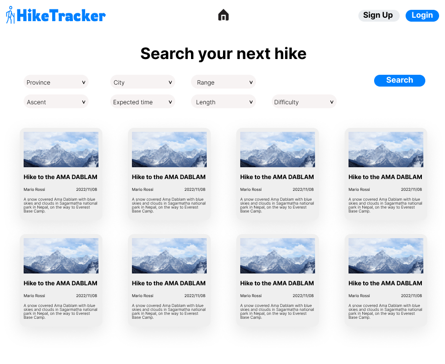
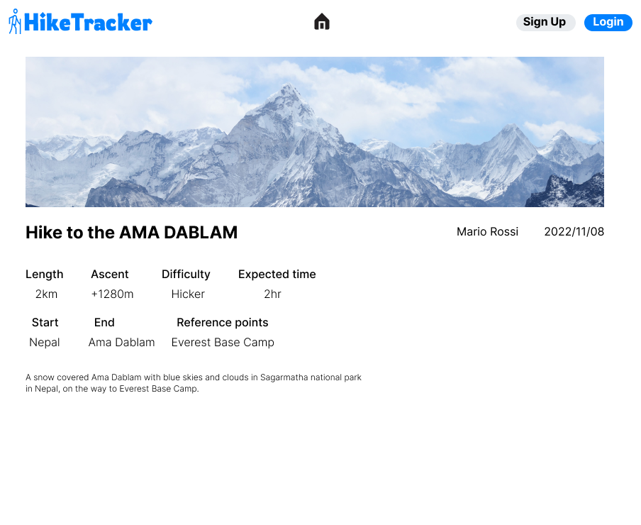
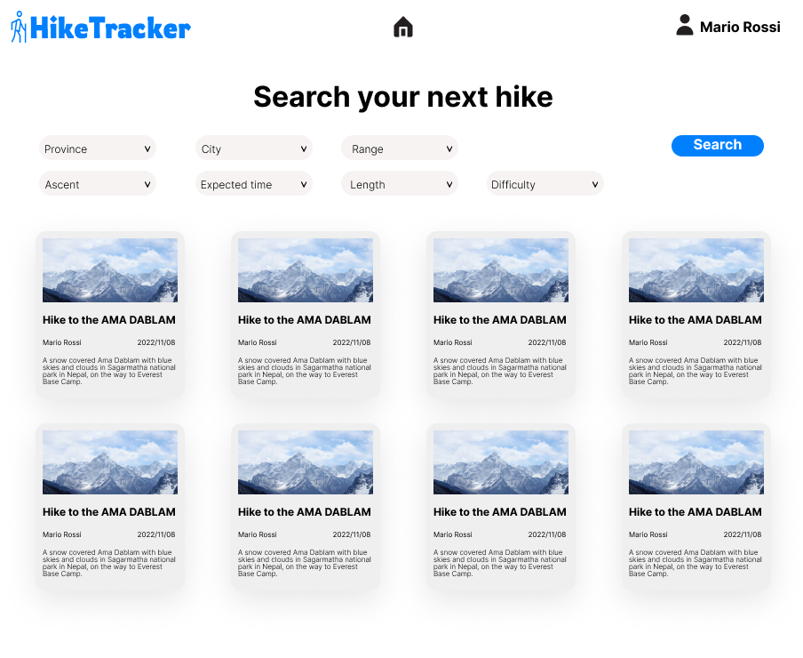
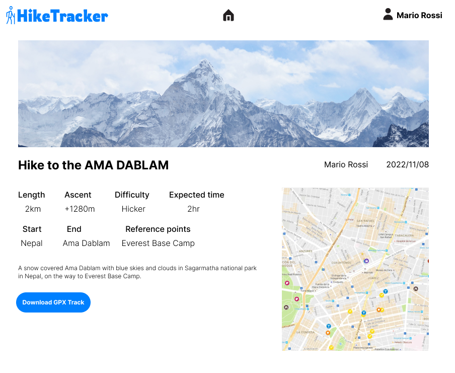

# HikeTracker

Project developed by ***Team-12*** for the course "Software Engineering II," attended during the academic year 2022/23 at Politecnico di Torino, Master's Degree in Computer Engineering.

## Table of Contents

1. [React Client Application Routes](#react-client-application-routes)
2. [API Server](#api-server)
3. [Database Tables](#database-tables)
4. [Test](#test)
5. [Technologies](#technologies)
   - [Frontend](#frontend)
   - [Backend](#backend)
   - [Test](#test)
6. [Source Directory Structure](#source-directory-structure)
7. [Mocks](#mocks)
8. [Team members](#team-members)

## React Client Application Routes

All routes available are listed below

- **`/`** : Home Page
- **`/login`** : In this route you can find the login form.
- **`/signup`** : In this route you can find the selection for the role to signup with.
- **`/signup/:role`** : In this route you can find the signup form for the selected role.
- **`/email/confirmed`** : In this route you can find the confirmation of the email.
- **`/email/error`** : In this route you can find the notification of the error for email confirmation.
- **`/hikes`** : Visitor Page
- **`/hikes/:${id}`** : Page with details and Map
- **`/*`** : Any other route is matched by this one where the application shows a page not found error.

## API Server

Hereafter, we report the designed HTTP APIs, also implemented in the project.

## Database Tables

### The tables used in this project are

#### *Hike* includes all hikes specifications

```
Hike(id, title, lenght, expectedTime, ascent, difficulty, description, startPointId, endPointId, userId, gpxFilePath)
     PRIMARY KEY ( Id )
     FOREIGN KEY (userId, startPointId, endPointId) REFERENCES User ( id ) , Point ( id ) , Point ( id )
```

#### *HikePoint* includes relation between Hike and Point

```
HikePoint( hikeId, pointId)
     PRIMARY KEY ( hikeId , pointId )
     FOREIGN KEY (hikeId , pointId ) REFERENCES Point ( id ) , Point ( id )
```

#### *Point* includes all Points specifications

```
HikePoint( id, name, description*, type, longitude, latitude, altitude, city, province )
     PRIMARY KEY ( id )
```

#### *Hut* includes all Huts specification

```
HikePoint( id, name, roomNumber, bedNumber, pointId, photosPath )
     PRIMARY KEY ( id )
     FOREIGN KEY ( pointId ) REFERENCES Point ( id )
```

#### *User* includes all Users specification

```
HikePoint( id, username, email, type, salt, hash, name*, surname*, phoneNumber*, verified )
     PRIMARY KEY ( id )
```

#### *Preferences* includes preferences specified by the user

```
HikePoint( id, duration, altitude, ascent, length, difficulty, userId )
     PRIMARY KEY ( id )
      FOREIGN KEY ( userId ) REFERENCES User ( id )

```

## Test

## Technologies

### Frontend

```names
- Axios
- Bootstrap
- Formik
- React
- React Bootstrap
- React Icons
- React Router Dom
- React Toastify
- Yup
- Dayjs
````

### Backend

```names
- Cors
- Express
- Express Session
- Morgan
- Passport
- Passport Local
- Sqlite3
- Dayjs
- Nodejs
````

### Test

```names
- Jest
- Mocha
- Cypress
````

## Source Directory Structure

Here you can find a visual schema of source directory structure by means the tree chart below and a short description for each folder.

```structure
|--- /client
     |--- /public
          |--- /favicon.ico
          |--- /index.html
          |--- /logo192.png
          |--- /logo512.png
          |--- /manifest.json
          |--- /robots.txt
     |--- /src
          |--- /assets
               |--- /carousel
                    |--- /first.jpg
                    |--- /second.jpg
                    |--- /third.jpg
                    |--- /fourth.jpg
               |--- /logo
                    |--- /logo-black.svg
                    |--- /logo-color.svg
                    |--- /logo-no-background.svg
                    |--- /logo-white.svg
          |--- /components
               |--- /ui-core
                    |--- /index.js
                    |--- /RegisterForm.jsx
               |--- /utils
                    |--- /index.js
                    |--- /Input.jsx
               |--- /index.js
          |--- /contexts
               |--- /AuthContext.jsx
          |--- /hooks
               |--- /useNotification.js
          |--- /services
               |--- /api.js
          |--- /views
               |--- index.js
               |--- Register.jsx
          |--- /App.css
          |--- /App.jsx
          |--- /App.test.jsx
          |--- /index.css
          |--- /index.js
          |--- /logo.svg
          |--- /reportWebVitals.js
          |--- /setupTests.js
     |--- /.gitignore
     |--- /package-lock.json
     |--- /package.json
     |--- /README.md
|--- /mocks
     |--- /hikeVisitor
          |--- /HikesPageVisitor_1.png
          |--- /HikesPageVisitor_2.png
     |--- /hikeWithInfo
          |--- /HikesPageHiker_1.png
          |--- /HikesPageHiker_2.png
     |--- /homePage
          |--- /Homepage_1.png
          |--- /Homepage_2.png
          |--- /Homepage_3.png
          |--- /Homepage_4.png
     |--- /loginPage
          |--- /LoginPage_1.png
          |--- /LoginPage_Correct_Field.png
          |--- /LoginPage_Error_Field.png
          |--- /LoginPage_Fail.png
     |--- /registrationPage
          |--- /RegistrationPage_1.png
          |--- /RegistrationPage_2.png
|--- /retrospective
|--- /server
     |--- /db
          |--- /dbmiddleware.js
          |--- /middlewares
          |--- /models
          |--- /routes
     |--- /gitignore
     |--- /index.js
     |--- /package-lock.json
     |--- /package.json
|--- /README.MD
```

## Mocks

### HomePage Carousel



### Login


### SignUp (minimum credentials version)



### SignUp (full)



### Hike Page (for visitors)



### Hike details (for visitors)



### Hike Page (for registered users)



### Hike details (for registered users)



## Team members

| Matricola   |   Surname   | Name        |
| :---------: | :---------  | :---------- |
| s301146     | Colelli     | Antonio     |
| s294427     | Hevia       | Adriana     |
| s305925     | Miccono     | Edoardo     |
| s303399     | Sambin      | Gabriele    |
| s303907     | Tamburo     | Luca        |
| s301587     | Trovero     | Fabio       |